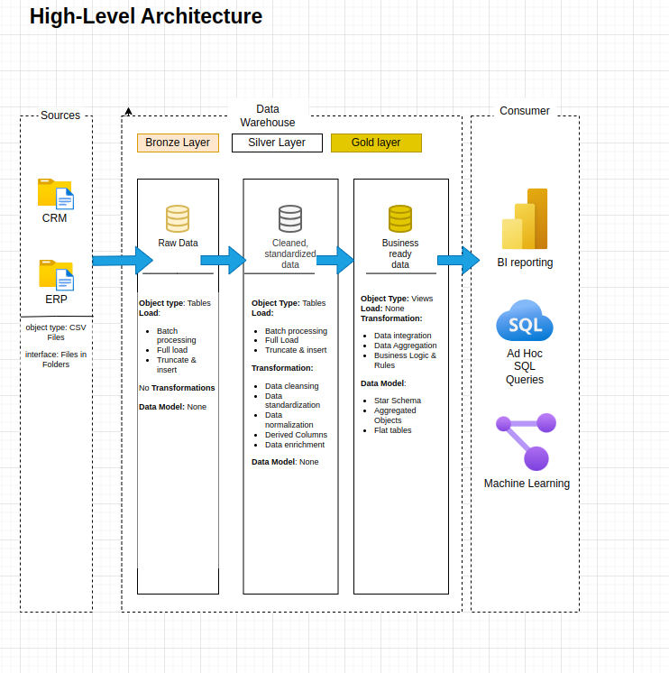

# Bike-Sales Data Warehouse

End-to-end ELT demo that spins up a **Bronze → Silver → Gold** warehouse on PostgreSQL with a single `docker compose up`.

---

## What’s inside?



| Layer      | Purpose                              | Built by                                                                                                |
| ---------- | ------------------------------------ | ------------------------------------------------------------------------------------------------------- |
| **Bronze** | Raw CSV landing zone (loose types)   | `init-scripts/02_create_bronze_tables.sql`<br>`init-scripts/03_load_bronze_tables.sql`                  |
| **Silver** | Typed / cleansed staging tables      | `scripts/silver/01_ddl.sql` (DDL)<br>`scripts/silver/02_clean_and_load_tables.sql` (PL/pgSQL load proc) |
| **Gold**   | Star-schema views for BI / reporting | `scripts/gold/01_views.sql`                                                                             |

---

## Repo layout

```bash
data-warehouse-project/
│
├─ init-scripts/ # executed once by Postgres entrypoint
│ ├─ datasets/ # source CSV files
│ ├─ 01_schemas_ddl.sql # CREATE SCHEMA bronze | silver | gold
│ ├─ 02_bronze_ddl.sql
│ └─ 03_load_bronze_dml.sql
│
├─ scripts/
│ ├─ silver/
│ │ ├─ 01_create_silver_tables_ddl.sql # Silver table definitions
│ │ └─ 02_load_silver_tables_dml.sql # load procedure + CALL
│ ├─ gold/
│   └─ 01_create_gold_views_ddl.sql # Gold dimension & fact views
│
├─ docker-compose.yml
├─ .env.example # copy ⇒ .env, CREDS {POSTGRES_DB, POSTGRES_USER, POSTGRES_PASSWORD}
└─ README.md
```

---

## Quick-start

```bash
# 1. Clone repo
git clone https://github.com/mikekibz59/data-warehouse-project.git
cd data-warehouse-project

# 2. (Optional) adjust env
cp .env.example .env && nano .env

# 3. Launch stack
docker compose up -d

# 4. Jump into psql
docker compose exec warehouse-db psql -U <POSTGRES_USER> bike_sales_data_warehouse
```

### First-boot behaviour

1. **Creates schemas** `bronze`, `silver`, `gold`.
2. **Builds Bronze tables** and bulk-loads the CSVs.

That’s it—the Silver cleanse and Gold star-schema are **not** run automatically so you can inspect / tweak Bronze first.

---

### Moving data forward

```bash
# create Silver tables
docker compose exec warehouse-db \
  psql -U <POSTGRES_USER> -id <POSTGRES_DB> \
  -f /scripts/silver/01_create_silver_tables_ddl.sql

# load Silver layer (defines + CALLs the procedure)
docker compose exec warehouse-db \
  psql -U <POSTGRES_USER> -d <POSTGRES_DB> \
  -f /scripts/silver/02_load_silver_tables_dml.sql

# create Gold views
docker compose exec warehouse-db \
  psql -U <POSTGRES_USER> -d <POSTGRES_DB> \
  -f /scripts/gold/01_create_gold_views_ddl.sql
```

### Common tasks

| Task                | Command                                        |
| ------------------- | ---------------------------------------------- |
| Re-run Silver load  | `CALL silver.load_silver();`                   |
| Recreate Gold views | `\i scripts/gold/01_create_gold_views_ddl.sql` |
| Check row counts    | `\dt+ silver.*`                                |
| Wipe everything     | `docker compose down -v`                       |

### Notes & design choices

- **Idempotent scripts** – `DROP … IF EXISTS` / `CREATE OR REPLACE`.
- **`dwh_create_date`** timestamp on every Silver row.
- **Logging** – ETL proc uses `RAISE NOTICE`; view with `docker logs`.
- **Single-transaction DDL** – each build script runs inside `BEGIN … COMMIT`.

### Next steps

- Swap CSV loads for CDC ingestion (Airbyte, Debezium).
- Materialise Gold views + schedule refresh.
- Add **dbt** / **SQLMesh** for declarative transformations.
